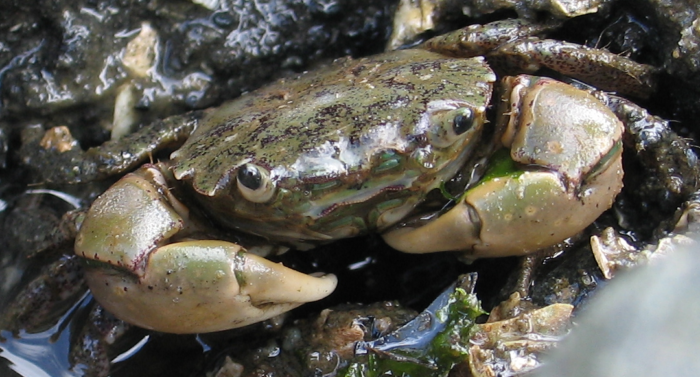
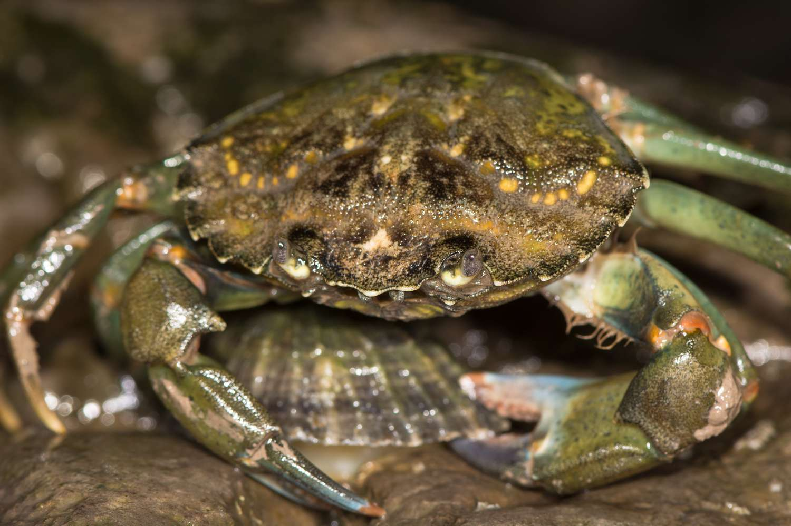

## Introduction

Human noise is common in coastal waters. This research focuses on the genus *Hemigrapsus*. We check if noise exposure from sources like floating concerts and shoreline construction causes physiological changes.

::: {layout-ncol=2}

*Hemigrapsus oregonensis* (Yellow shore crab). This species is native to the Pacific coast and is not currently listed as endangered.

*Carcinus maenas* (European green crab). This species is highly invasive in North American waters and is not currently listed as endangered.
:::

We measure two main variables to quantify stress: respiration rate and scaphognathite beat rate. The scaphognathite ventilates the gill chamber. Its speed shows metabolic demand and stress [@wale2013].

Data and methods are discussed in @sec-data-methods.

## Literature Baselines

While we collect data for this study, @tbl-baselines shows typical physiological ranges for shore crabs in resting conditions.

| Measurement | Typical Resting Range | Reference |
| :--- | :--- | :--- |
| Respiration ($\text{MO}_2$) | 1.5 - 2.5 $\mu$mol $O_2$ / g / h | @wale2013 |
| Scaphognathite Rate | 40 - 80 beats / min | Literature Standard |
| Hemolymph Osmolarity | 900 - 1050 mOsm/kg | Regional Baselines |

: Established Physiological Norms for Shore Crabs {#tbl-baselines}

## Data & Methods {#sec-data-methods}

### Weekly Monitoring
The exact protocol for weekly monitoring is TBD. We are currently determining the duration and frequency of respirometry tests. Methods for recording scaphognathite beats are also being finalized.

### Terminal Hemolymph Sampling
At the end of the exposure period we will perform a terminal blood draw. Hemolymph will be extracted and analyzed to determine the impact on osmoregulatory capacity.

## Conclusion

This pilot study evaluates if anthropogenic noise leads to metabolic exhaustion or osmoregulatory failure in *Hemigrapsus*.

## References {.unnumbered}

:::{#refs}
:::